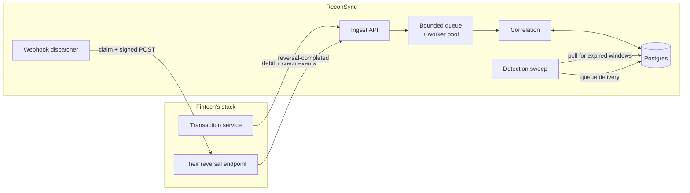
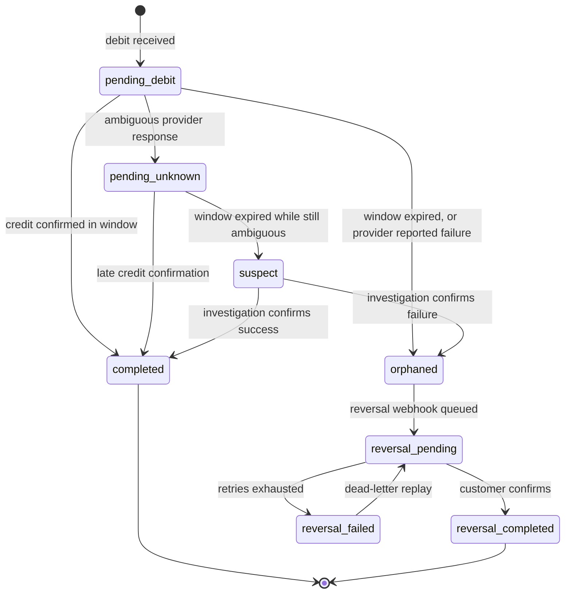

# ReconSync

Drop-in transaction reconciliation middleware for fintechs.

ReconSync watches a transaction stream for debits that never received a matching
credit confirmation, and fires a signed reversal webhook back to the customer's
system before the regulatory clock runs out.

---

## 1. The problem

In a transfer, money leaves the customer's wallet (the **debit leg**) and arrives
at the destination (the **credit leg**). Between them sits a provider API call
that can time out, return ambiguously, or succeed silently after the client has
already given up. When the credit leg fails and the debit is not reversed, the
customer has lost money.

The problem is structural, not a matter of writing better code:

> **The system that failed cannot be the system that detects the failure.**

If the transaction service crashed mid-flow, its own reconciliation logic
crashed with it. So most fintechs fall back to nightly batch reconciliation,
which means a customer can be out of pocket for up to 24 hours — far outside any
mandated reversal window.

ReconSync is a separate process that observes both legs and notices when the
second one never arrives.

### What it is not

**ReconSync never moves money.** It observes, detects, records and notifies; the
fintech's own system performs the reversal. Every webhook payload is explicitly
marked `"advisory": true`, and the receiver is expected to verify against its own
ledger before acting.

This boundary is deliberate and load-bearing: even a total compromise of
ReconSync — every key stolen, every row rewritten — cannot cause an unauthorised
payment. The worst an attacker achieves is noise in a queue.

---

## 2. How it works



The path an event takes:

1. **Ingest** (`POST /v1/events/debit`). The handler authenticates the API key,
   validates the payload, screens it for card data, resolves the reconciliation
   window from the tenant's rules, and hands the event to the queue. It returns
   `202` immediately — the caller never waits on a database write.
2. **Queue** (`internal/pipeline`). A bounded channel feeding a worker pool.
   Workers accumulate events into batches, flushing at 100 events or every
   200 ms, whichever comes first. A full queue returns `ErrBackpressure`, which
   the API turns into `429` with `Retry-After`.
3. **Correlate** (`internal/correlate`). Each batch is grouped by tenant, then
   applied: debits are stored with their deadline, credits are matched to their
   debit and settle it.
4. **Detect** (`internal/service.Detector`). Every 5 seconds a sweep claims
   transactions whose window has closed and queues the reversal webhook.
5. **Dispatch** (`internal/service.Dispatcher`). Claims due deliveries, signs
   them, POSTs them, and retries or dead-letters based on the response.

### Transaction lifecycle



Two states carry most of the product's judgement:

- **`suspect`** exists because a provider that answers ambiguously has not told
  us the credit failed. Naively reversing every missing credit would double-pay
  every customer whose credit succeeded but whose confirmation was lost in
  transit. An ambiguous transaction that outlives its window raises an
  investigation, never an automatic reversal.
- **`completed` is terminal and absorbing.** Nothing can move a settled
  transaction — not a replayed credit, not a late failure report. This is what
  makes a replay attack against the ingest API useless.

---

## 3. What each package does

### `internal/domain` — the rules, with no infrastructure

The transaction types and the state machine. It imports nothing but the standard
library, so the logic that decides whether money gets reversed can be read and
tested without wading through database code.

The state machine is written as **data, not control flow**:

```go
var allowedTransitions = map[Status]map[Status]struct{}{
    StatusPendingDebit: {StatusCompleted: {}, StatusPendingUnknown: {}, StatusOrphaned: {}},
    ...
}
```

Tests assert the *exact* edge set. Adding a transition fails the build rather
than quietly permitting a new way to move money. A state added without edges is
terminal by default — the safe direction to fail, since a stuck transaction gets
noticed by alerting while a wrongly-mobile one could pay a customer twice.

This package also holds the **card-data screen**: a denylist of field names
(`cvv`, `bvn`, `card_number`, …, matched with separators and case normalised)
plus a Luhn check over 13–19 digit runs. We cannot leak what we never collected.

### `internal/rules` — how long a transaction has

Resolves the reconciliation window for a transaction. Rules match on transaction
type, provider, currency and amount band; the default is 300 seconds.

Precedence is: highest priority wins, then the more specific rule, then the lower
rule ID. That last tiebreak matters — without it, the window a transaction gets
could flip between scans depending on row ordering.

> Currently the rule provider is stubbed to defaults in the server binary.
> Loading rules from the database is not yet implemented.

### `internal/store` — persistence, tenant-scoped by construction

Every tenant-scoped method takes `tenantID` as its **first argument**, so a
forgotten scope is a compile error rather than a data leak. Cross-tenant reads
return `ErrNotFound`, never a permission error — a 403 would confirm the record
exists.

Two implementations, in-memory and Postgres, are held to **one shared
conformance suite**, so the fake used in unit tests cannot drift from the real
thing. That suite has already caught a divergence: the in-memory store let a key
be revoked twice while Postgres guarded on `revoked_at IS NULL`.

Two methods are deliberately *not* tenant-scoped, and both are documented as
such: `ClaimExpired` (the detection sweep runs across all tenants) and
`APIKeyByPrefix` (it is what resolves the tenant in the first place).

### `internal/pipeline` — bounded everything

The §4.3 worker pool. Its whole job is to absorb load without ever blocking the
caller:

```go
select {
case p.ingest <- ev:
    return nil
default:
    p.dropped.Add(1)
    return ErrBackpressure   // handler returns 429 + Retry-After
}
```

The `default:` branch is the design. Blocking until space frees would push
latency back onto the customer's transaction path, which is the one thing this
system must never do. A monitoring system that can take down the thing it
monitors is worse than no monitoring system.

On shutdown, workers flush with `context.WithoutCancel` — the signal that
triggered shutdown must not cancel the flush it started.

### `internal/correlate` — matching the two legs

Applies a batch to storage. Within a batch, **debits are applied before
credits**, because a fast transaction often has both legs in the same flush and
the credit can only land once its debit exists.

Credits whose debit has not arrived yet are **parked** rather than dropped, then
applied when the debit turns up. The park/apply cycle is more careful than it
looks — see §6.

Per-event problems (a malformed amount, card data in metadata) are collected as
rejections and never fail the batch: one bad event must not discard the other
ninety-nine.

### `internal/auth` — API keys

Keys are `rs_{env}_{random}`. Only a **prefix** (plaintext, for lookup) and an
**argon2id hash** are stored; the secret is shown once at creation and is not
retrievable.

argon2id costs ~64 MiB per verification, which is correct for a credential and
ruinous on a path taking thousands of events a second. Successful verifications
are therefore cached against a SHA-256 of the presented secret, so the expensive
path runs about once per key per minute. The cache bounds how long a revocation
takes to take effect, which is why `Invalidate` exists.

Every authentication failure returns the same error. A caller must not be able
to tell an unknown key from a revoked one from a wrong one.

### `internal/ingest` — the HTTP surface

Handlers, authentication middleware, request IDs, panic recovery, body size
limits, and error mapping. The mapping matters: a rejected replay or an
out-of-order event is ordinary client behaviour and returns `409`/`202`, not
`500`. If every SDK retry looked like a server fault, the error rate would be
meaningless.

`/healthz` reports **process liveness only** and never touches the database.
Pointing a liveness probe at a dependency turns a brief database blip into a
simultaneous restart of every pod — a recoverable incident converted into an
outage. `/readyz` is the one that checks dependencies.

### `internal/webhook` — signing, retries, and not getting used as an SSRF pivot

Signatures are HMAC-SHA256 over `{timestamp}.{body}`, sent as
`X-ReconSync-Signature: t=...,v1=...`. Signing the timestamp alongside the body
is what stops a captured request being replayed. The scheme is deliberately
Stripe's — widely understood, and not a novel cryptographic design.

Retries run at 0s, 30s, 2m, 10m, 1h, 6h with ±20% jitter, then dead-letter. A
4xx other than 408/429 dead-letters *immediately*: retrying a rejected request
six times over six hours just repeats the rejection.

The SSRF defence has two halves, and only the second one actually works:

- At registration, the URL must be HTTPS and must not be a literal private address.
- **At dial time**, after DNS resolution and immediately before the socket
  connects, the resolved IP is checked again. This is what defeats DNS
  rebinding; validating only at registration does not. Redirects are never
  followed, since a 302 to an internal address would sidestep both checks.

### `internal/service` — the background loops

**Detector** sweeps every 5 seconds using `SKIP LOCKED`, so it is safe across N
replicas with no leader election. It only moves a transaction to
`reversal_pending` once a delivery has actually been queued — claiming a reversal
is pending when nothing will deliver it would be a lie the dashboard repeats.

**Dispatcher** claims due deliveries with a **lease** (it pushes `next_retry_at`
forward) rather than a separate "sending" state. A worker that dies mid-attempt
simply becomes claimable again when the lease lapses; there are no stuck rows to
reap.

---

## 4. Quick start

Requires Go 1.23+ and Postgres 16.

```bash
createdb reconsync
for f in migrations/000*.up.sql; do psql -v ON_ERROR_STOP=1 -d reconsync -f "$f"; done

export RECONSYNC_DATABASE_URL="postgres://localhost:5432/reconsync?sslmode=disable"
export RECONSYNC_TENANT_SALT="$(openssl rand -hex 16)"
export RECONSYNC_WEBHOOK_SECRET="$(openssl rand -hex 24)"

go run ./cmd/reconsyncctl doctor
go run ./cmd/reconsyncctl tenant create --id tnt_acme --env test
go run ./cmd/reconsyncctl keys create --tenant tnt_acme --env test

# The secret prints once. Export it — the calls below need it.
export RECONSYNC_KEY="rs_test_..."

go run ./cmd/reconsync
```

`doctor` checks database reachability, that every table exists, and **clock
skew** — skew breaks webhook signature verification with an error message that
tells the operator nothing, so it is worth surfacing directly.

Report a debit, then its credit:

```bash
curl -X POST localhost:8080/v1/events/debit \
  -H "Authorization: Bearer $RECONSYNC_KEY" \
  -H 'Content-Type: application/json' \
  -H 'Idempotency-Key: 550e8400-e29b-41d4-a716-446655440000' \
  -d "{\"transaction_id\":\"TXN-1\",\"transaction_type\":\"transfer\",\"provider\":\"paystack\",
       \"amount_minor\":5000000,\"currency\":\"NGN\",\"debit_at\":\"$(date -u +%Y-%m-%dT%H:%M:%SZ)\"}"
# 202 {"status":"accepted","expected_completion_at":"...","window_seconds":300}

curl -X POST localhost:8080/v1/events/credit \
  -H "Authorization: Bearer $RECONSYNC_KEY" \
  -H 'Content-Type: application/json' \
  -H 'Idempotency-Key: 550e8400-e29b-41d4-a716-446655440001' \
  -d '{"transaction_id":"TXN-1","status":"success"}'
```

`debit_at` is generated rather than fixed: a hard-coded past timestamp would
already be outside its window on arrival and get detected as an orphan
immediately, which is a confusing first experience.

If no credit arrives before `expected_completion_at`, the sweep marks the debit
orphaned and queues a signed `reversal.triggered` webhook:

```json
{
  "event": "reversal.triggered",
  "occurred_at": "2026-08-11T09:19:27Z",
  "data": {
    "transaction_id": "TXN-1",
    "amount_minor": 5000000,
    "currency": "NGN",
    "reason": "no_credit_confirmation_within_window",
    "window_seconds": 300,
    "detected_at": "2026-08-11T09:19:25Z",
    "regulatory_deadline": "2026-08-11T09:19:22Z",
    "advisory": true
  }
}
```

`regulatory_deadline` is included so the receiver can prioritise by urgency
without knowing our rules — it removes a whole category of integration question.

---

## 5. API

| Method | Path | Purpose |
| --- | --- | --- |
| POST | `/v1/events/debit` | Report the debit leg. Returns 202 and the window granted. |
| POST | `/v1/events/credit` | Report the verdict: `success`, `failed` or `unknown`. |
| POST | `/v1/events/bulk` | Up to 1000 mixed events, for backfill. |
| POST | `/v1/events/reversal-completed` | Confirm a reversal; returns detection-to-confirmation elapsed time. |
| GET | `/v1/transactions/{id}` | One transaction. |
| GET | `/v1/transactions?status=&limit=` | List by state. |
| GET | `/healthz` `/readyz` `/metrics` | Liveness, readiness, Prometheus metrics. |

Ingest is asynchronous, so both event endpoints return `202 Accepted` rather
than a reconciled result — at the moment the handler replies, the outcome is
genuinely not known yet.

**Credit verdicts** map as follows. `success` and `unknown` are per spec;
`failed` orphaning immediately is an interpretation — an explicit provider
failure means the credit definitively did not happen, so waiting out the window
would only spend regulatory clock to learn what we already know.

| Verdict | Resulting state |
| --- | --- |
| `success` | `completed` |
| `failed` | `orphaned` |
| `unknown` | `pending_unknown` |

---

## 6. Correctness notes

These are the parts that were harder than they looked.

### Out-of-order credits

A credit can arrive before its debit. It is parked in `pending_credits` and
applied when the debit lands. The subtlety is that a parked credit must be
**read without being removed**, and deleted only once it has actually been
applied:

An earlier version took the credit (a destructive `DELETE ... RETURNING`), then
tried to apply it. If the apply failed because the debit still was not there, the
credit was gone — and the debit's own sweep had already run and found nothing. The
transaction would later be reversed *despite its credit having succeeded*, which
is the exact double-payment this product exists to prevent. It surfaced as one
stranded transaction in a 400-event end-to-end run, intermittently.

### A credit racing the detection sweep

Both can touch the same row at the same instant. The state guard rides in the
same statement as the write:

```sql
UPDATE transactions SET status = $3, credit_at = $4
WHERE tenant_id = $1 AND transaction_id = $2 AND status = ANY($5)
```

`$5` is generated from the state machine via `domain.SourcesFor`, so the SQL
cannot drift from the Go. Exactly one side wins; the loser is rejected cleanly.
A test runs 40 rounds, asserts exactly one winner each time, and logs the split
between the two outcomes — if one side ever won every round the schedule would be
deterministic and the test would be asserting nothing, so it reports that rather
than passing silently.

There is a second-order trap here that cost a real bug: when the guarded UPDATE
matches nothing, the code re-reads the row to decide *why*. If the debit is
inserted in that gap, the re-read finds a legal state and reporting "invalid
transition" would **discard a perfectly valid credit**. It retries instead.

### Detection across replicas

The sweep uses `FOR UPDATE SKIP LOCKED`, which is safe across N replicas with no
leader election. A test runs five concurrent schedulers against 50 expired rows
and asserts every row is claimed exactly once.

---

## 7. Configuration

| Variable | Required | Default | Meaning |
| --- | --- | --- | --- |
| `RECONSYNC_DATABASE_URL` | yes | — | Postgres connection string |
| `RECONSYNC_TENANT_SALT` | yes | — | Pseudonymises customer references |
| `RECONSYNC_WEBHOOK_SECRET` | yes | — | Signs outbound webhooks |
| `RECONSYNC_ADDR` | no | `:8080` | Listen address |
| `RECONSYNC_DRAIN_TIMEOUT_SECONDS` | no | `20` | Graceful shutdown budget |
| `RECONSYNC_ALLOW_PRIVATE_WEBHOOK_TARGETS` | no | `false` | **Local development only.** Disables the SSRF guard so webhooks can reach loopback. |

The two secrets are required rather than defaulted: starting with a predictable
salt would pseudonymise every customer reference identically, which is worse
than not starting at all.

---

## 8. Data handling

| Class | Examples | Rule |
| --- | --- | --- |
| Never collect | PAN, CVV, passwords, BVN | Rejected at ingest by field denylist and a Luhn check |
| Pseudonymise | Customer reference | SHA-256 with a per-tenant salt before storage |
| Store | Amount, currency, status, timestamps, provider | Stored as-is |

Money is **always `BIGINT` in minor units**, with a `CHECK (amount_minor > 0)`.
Never a float, anywhere.

The audit table is append-only, enforced at the database rather than promised by
the application: triggers reject `UPDATE`, `DELETE` **and `TRUNCATE`**. The
truncate guard is statement-level, because row triggers do not fire on `TRUNCATE`
and it would otherwise walk straight through the other two.

> The audit hash chain and signed checkpoints are not yet implemented — only the
> immutability enforcement is.

---

## 9. Development

```bash
make test              # unit tests, race detector, no database needed
make test-integration  # full suite against a local Postgres
make test-isolation    # the tenant isolation gate on its own
make lint              # golangci-lint, pinned to the version CI uses
make vuln              # govulncheck
make crosscheck        # build for linux/amd64, which is what CI runs
make ci                # everything above
```

Integration tests read `RECONSYNC_TEST_DATABASE_URL` and skip cleanly without
it, so `make test` works on a machine with no database.

`make crosscheck` is not busywork: development here is arm64 and CI is amd64, and
a missing platform-specific dependency passes every local check before failing in
CI. That has already happened once.

**Tests live in `tests/`**, not beside the code, and therefore exercise only the
exported API — the same surface a caller gets. Coverage needs
`-coverpkg=./internal/...`, which the Makefile and CI already pass.

Migrations ship as `.up.sql`/`.down.sql` pairs. The down files are what let the
test harness reset to a known schema, and running `up → down → up` in the gate is
what proves a down migration is complete. On a live database they are a last
resort — reversing a schema also deletes the data in it.

---

## 10. Layout

```text
cmd/reconsync/       server: ingest API, detection sweep, webhook dispatcher
cmd/reconsyncctl/    admin CLI: doctor, tenant create, keys create
internal/domain/     transaction types + state machine (no infrastructure deps)
internal/rules/      reconciliation window resolution
internal/store/      persistence port, in-memory and Postgres implementations
internal/correlate/  matches credit legs to debits
internal/pipeline/   bounded worker pool, batching, backpressure
internal/auth/       API key issue and verification
internal/ingest/     HTTP API, health, readiness, metrics
internal/webhook/    payload signing, retry policy, SSRF-guarded client
internal/service/    detection sweep and webhook dispatch loops
migrations/          schema, applied forward and backward in tests
tests/               the whole suite, exercising only the exported API
```

---

## 11. Status

Working end to end: a debit whose window closes is detected, and a signed webhook
is delivered to the registered endpoint.

| Component | State |
| --- | --- |
| Transaction state machine | Done |
| Card-data / PII screen | Done |
| Postgres schema + migrations | Done |
| Store layer, tenant-scoped | Done — two implementations, one conformance suite |
| Detection sweep with `SKIP LOCKED` | Done |
| Reconciliation window rules | Done, in-memory rule sets only |
| Ingest pipeline: batching, backpressure | Done |
| Correlation, incl. out-of-order credits | Done |
| API key auth: argon2id, per-environment | Done |
| Ingest HTTP API, health, readiness, metrics | Done |
| Webhook signing, retries, DLQ, SSRF guard | Done |
| Server binary and admin CLI | Done |
| Rules loaded from the database | **Not started** — provider stubbed to defaults |
| Endpoint management API | **Not started** — endpoints are inserted directly |
| Audit hash chain and signed checkpoints | **Not started** |
| Dashboard, SDKs, bulk reporting | **Not started** |
