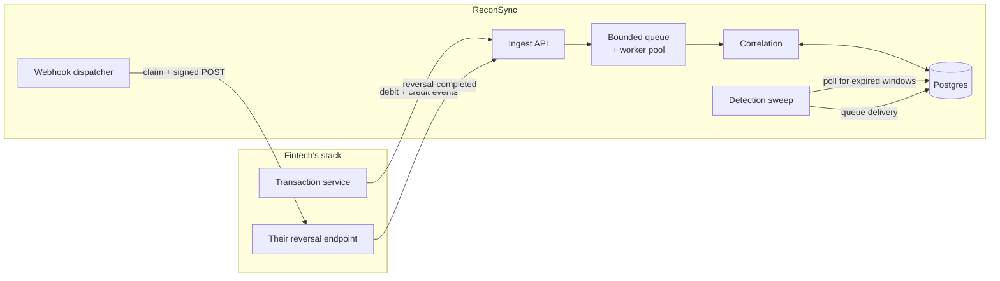
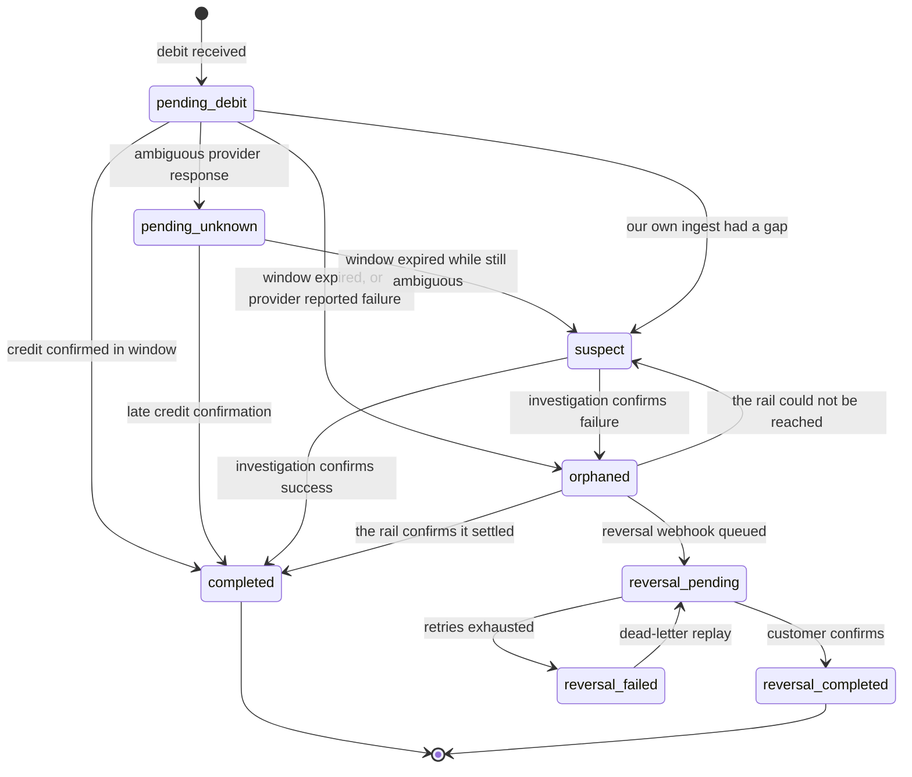

# ReconSync

Drop-in transaction reconciliation middleware for fintechs.

ReconSync watches a transaction stream for debits that never received a matching
credit confirmation, and fires a signed reversal webhook back to the customer's
system before the regulatory clock runs out.

---

## 1. The problem

In a transfer, money leaves the customer's wallet (the **debit leg**) and arrives
at the destination (the **credit leg**). Between them sits a provider API call
that can time out, return ambiguously, or succeed silently after the client has
already given up. When the credit leg fails and the debit is not reversed, the
customer has lost money.

The problem is structural, not a matter of writing better code:

> **The system that failed cannot be the system that detects the failure.**

If the transaction service crashed mid-flow, its own reconciliation logic
crashed with it. So most fintechs fall back to nightly batch reconciliation,
which means a customer can be out of pocket for up to 24 hours — far outside any
mandated reversal window.

ReconSync is a separate process that observes both legs and notices when the
second one never arrives.

### What it is not

**ReconSync never moves money.** It observes, detects, records and notifies; the
fintech's own system performs the reversal. Every webhook payload is explicitly
marked `"advisory": true`, and the receiver is expected to verify against its own
ledger before acting.

This boundary is deliberate and load-bearing: even a total compromise of
ReconSync — every key stolen, every row rewritten — cannot cause an unauthorised
payment. The worst an attacker achieves is noise in a queue.

---

## 2. How it works



The path an event takes:

1. **Ingest** (`POST /v1/events/debit`). The handler authenticates the API key,
   validates the payload, screens it for card data, resolves the reconciliation
   window from the tenant's rules, and hands the event to the queue. It returns
   `202` immediately — the caller never waits on a database write.
2. **Queue** (`internal/pipeline`). A bounded channel feeding a worker pool.
   Workers accumulate events into batches, flushing at 100 events or every
   200 ms, whichever comes first. A full queue returns `ErrBackpressure`, which
   the API turns into `429` with `Retry-After`.
3. **Correlate** (`internal/correlate`). Each batch is grouped by tenant, then
   applied: debits are stored with their deadline, credits are matched to their
   debit and settle it.
4. **Detect** (`internal/service.Detector`). Every 5 seconds a sweep claims
   transactions whose window has closed and queues the reversal webhook.
5. **Dispatch** (`internal/service.Dispatcher`). Claims due deliveries, signs
   them, POSTs them, and retries or dead-letters based on the response.

### Transaction lifecycle



Three edges are not in the original design, and each exists to stop a reversal
that should not happen:

- `pending_debit -> suspect` — **our own** ingest had a gap over that window, so
  the missing credit proves nothing (ADR-0004).
- `orphaned -> completed` — the rail confirms the money arrived after all
  (ADR-0005).
- `orphaned -> suspect` — the rail could not be reached, and a guess here moves
  real money (ADR-0005).

All three are reachable only *before* a reversal is dispatched.

Two states carry most of the product's judgement:

- **`suspect`** exists because a provider that answers ambiguously has not told
  us the credit failed. Naively reversing every missing credit would double-pay
  every customer whose credit succeeded but whose confirmation was lost in
  transit. An ambiguous transaction that outlives its window raises an
  investigation, never an automatic reversal.
- **`completed` is terminal and absorbing.** Nothing can move a settled
  transaction — not a replayed credit, not a late failure report. This is what
  makes a replay attack against the ingest API useless.

---

## 3. What each package does

### `internal/domain` — the rules, with no infrastructure

The transaction types and the state machine. It imports nothing but the standard
library, so the logic that decides whether money gets reversed can be read and
tested without wading through database code.

The state machine is written as **data, not control flow**:

```go
var allowedTransitions = map[Status]map[Status]struct{}{
    StatusPendingDebit: {
        StatusCompleted: {}, StatusPendingUnknown: {},
        StatusOrphaned: {}, StatusSuspect: {},
    },
    ...
}
```

Tests assert the *exact* edge set. Adding a transition fails the build rather
than quietly permitting a new way to move money. A state added without edges is
terminal by default — the safe direction to fail, since a stuck transaction gets
noticed by alerting while a wrongly-mobile one could pay a customer twice.

This package also holds the **card-data screen**: a denylist of field names
(`cvv`, `bvn`, `card_number`, …, matched with separators and case normalised)
plus a Luhn check over 13–19 digit runs. We cannot leak what we never collected.

### Partial settlements, fees, and splits

Until recently a credit event carried **no amount at all**. A ₦50,000 debit
settled by a ₦10,000 credit was marked `completed`, and the customer was quietly
short ₦40,000. The product exists to notice a customer is out of pocket, and it
could not notice being *partly* out of pocket.

A credit may now state `amount_minor`, and a debit may state
`expected_credit_minor` for the case where they differ:

| Case | Behaviour |
| --- | --- |
| Credit with no amount | Settles in full — exactly as before, so no existing integration changes |
| Credit short of expected | Stays open; the window still expires and reverses |
| Several credits summing to expected | Settles once the total arrives |
| Fee: debit 50,000, expect 49,750, credit 49,750 | Settles. The fee is not a shortfall |
| More than expected | `suspect` — an overpayment is not a settlement and not a failure |

A credit may also state its `currency`. **An amount without a currency is not a
quantity of money** — 5,000,000 kobo and 5,000,000 of anything else compare
equal — so a credit whose currency differs from the transaction's settles
nothing and goes to `suspect` for a human. The exposure report already refused
to sum across currencies for exactly this reason; settlement was the
inconsistent half.

**Accumulation had to be made idempotent, and that was not obvious.** The old
path was replay-safe for free, because a settled transaction rejects further
credits. A running total is not: the pipeline can legitimately deliver the same
credit twice — one that overtakes its debit is parked and drained later, and a
client retry is ordinary behaviour — and a second application would settle a
₦20,000 transfer with a ₦10,000 credit. Every credit is now claimed by
idempotency key in the same transaction as the accumulation.

That bug reached a green test suite. It surfaced as a *flaky* test, and only
after the failure message was made to print what it actually saw — a doubled
total — rather than just that it had timed out.

Credits have no idempotency dedupe at ingest, unlike debits, so that claim
inside the store is the only thing standing between a client retry and a doubled
total. There is a test that sends the same credit five times over HTTP and
asserts it counts once.

Adding partial settlement also **invalidated the exposure report**, which summed
the full debited amount and so counted money that had already reached the
destination as still outstanding. Exposure is now the shortfall — what left and
has not arrived — and a test asserts the age bands sum to the same figure as the
total, so the report cannot contradict itself between two of its own sections.

It invalidated the **reversal advice** too, which is the more serious of the
two because that is the message that causes money to move. It stated
`amount_minor` alone, so a receiver acting on it would refund the whole debit
when a fifth of it had already reached the destination — the over-payment this
product exists to prevent, caused by our own advice. A partly settled
transaction now carries `credited_minor` and `outstanding_minor`, its reason
becomes `partial_settlement_outstanding` rather than the false
`no_credit_confirmation_within_window`, and its evidence line reads *"only
1000000 of 5000000 credited within 300s"* instead of *"no credit within 300s"*.

Both fields are omitted when nothing arrived, so the payload an existing
receiver sees is byte-for-byte what it always was.

### `internal/rules` — how long a transaction has

Resolves the reconciliation window for a transaction. Rules match on transaction
type, provider, currency and amount band; the default is 300 seconds.

Precedence is: highest priority wins, then the more specific rule, then the lower
rule ID. That last tiebreak matters — without it, the window a transaction gets
could flip between scans depending on row ordering.

Rules are stored per tenant and read on the ingest path, so they are cached for
15 seconds rather than queried per debit — a rule change lands within that window
without a restart. If the rules query fails, the last known set is served rather
than rejecting the debit: losing reconciliation coverage over a configuration
read would be the wrong trade.

### `internal/store` — persistence, tenant-scoped by construction

Every tenant-scoped method takes `tenantID` as its **first argument**, so a
forgotten scope is a compile error rather than a data leak. Cross-tenant reads
return `ErrNotFound`, never a permission error — a 403 would confirm the record
exists.

Two implementations, in-memory and Postgres, are held to **one shared
conformance suite**, so the fake used in unit tests cannot drift from the real
thing. That suite has already caught a divergence: the in-memory store let a key
be revoked twice while Postgres guarded on `revoked_at IS NULL`.

Two methods are deliberately *not* tenant-scoped, and both are documented as
such: `ClaimExpired` (the detection sweep runs across all tenants) and
`APIKeyByPrefix` (it is what resolves the tenant in the first place).

### `internal/health` — knowing when we don't know

Detection concludes that a transaction failed because no credit event arrived.
That inference is only sound if we actually received everything the tenant sent.

We don't always. The pipeline drops events under backpressure — deliberately,
because blocking the caller is worse — and a batch can fail to apply. In both
cases our view of that tenant has a hole, and the credit we never saw may have
arrived perfectly well.

So the pipeline reports per-tenant outcomes, a recorder accumulates them in
memory and flushes per-minute counters to `ingest_health`, and the detection
sweep checks — in the same statement that claims the transaction — whether any
minute the window spans lost events. If one did, the transaction goes to
`suspect` for a human instead of reversing (ADR-0004).

Without this, a burst of backpressure silently becomes a burst of reversals.

The same counters answer a second question: **has this tenant stopped sending
altogether?** Zero events from a tenant that normally sends thousands an hour is
a broken integration, not a quiet spell — and nothing can be concluded about any
of their individual transactions while it lasts.

Sweeping them anyway would fire a reversal for every debit in flight, hundreds of
them, into a system that is already down, at the worst possible moment. So a
silent tenant is skipped entirely and one alert is raised instead of a thousand
webhooks. Their transactions stay open and settle normally once the tenant
recovers and sends the credits it owes.

Suppressing detection *silently* would be the worst of both worlds — nothing is
being watched and nobody has been told — so the tenant gets an
`integration.silent` webhook, and an `integration.recovered` one when events
resume. An alert that never clears trains people to ignore alerts.

Three things make it usable rather than noise:

- **Once per episode, not once per sweep.** A tenant that goes quiet at 2am must
  not receive a webhook every five seconds until morning. The episode is claimed
  with an `INSERT … ON CONFLICT DO NOTHING` against a table keyed by tenant, so
  several replicas sweeping the same tenants produce exactly one alert between
  them. The row is deleted on recovery, which both closes the episode and re-arms
  it for the next one.
- **Dated from their last event, not from when we noticed.** Telling a tenant
  they went quiet "just now" after a three-hour outage would understate it by
  three hours.
- **It says what stopped.** `detection_suspended: true` is the part that costs
  money — while the alert stands, none of their transactions are being judged.

These two events concern the stream rather than a transaction, so they carry no
transaction id. Inventing one to fit the usual payload shape would put a
transaction that does not exist into the customer's delivery log.

A tenant is only "silent" if it was *previously* active — ten or more minutes
carrying events in the preceding hour. Without that baseline a genuinely
low-volume tenant, or a brand new deployment with no history, would be mistaken
for a broken one and never have anything detected at all.

Deliberate consequence: a tenant that goes silent and never returns has its
transactions held indefinitely rather than reversed. That is the right call —
firing reversals into a dead integration helps nobody, and the held transactions
are visible through `GET /v1/transactions?status=pending_debit` and the sweep's
own alert.

The check is deliberately conservative: we cannot know *which* events a drop
destroyed, so any overlap makes the window unreliable. Some genuinely orphaned
transactions will wait for a human. That is the right direction to be wrong in —
a delayed reversal is a complaint, a wrong reversal is a double payment.

### `internal/provider` — asking instead of guessing

Silence is the weakest evidence in the system. This package turns "we heard
nothing" into "we asked, and here is what we found" — a status query against the
rail that actually moved the money.

Four outcomes: `settled`, `failed`, `not_found`, `unknown`. The whole design
turns on the last one. **Every** failure path — unreachable, timed out, HTTP 500,
malformed JSON, an unrecognised status string, no adapter registered, an adapter
that panicked into an error — produces `unknown`, never a verdict. A provider
fault is not a failed transfer, and treating it as one would move real money.

`not_found` is the exception worth noting: a provider with no record of a
transfer we believe we initiated is itself evidence that it never happened.

The HTTP adapter is deliberately generic rather than one type per rail. Paystack,
Flutterwave and most bank status endpoints all answer "what is the status of X"
with a JSON field; the differences are configuration, not code. A rail that does
not fit implements `StatusProvider` directly.

The sweep consults it **after** claiming an orphan and **before** queueing
anything: after the claim so two replicas cannot both ask, before the queue so a
wrong verdict never reaches the customer.

| Rail says | What happens |
| --- | --- |
| `settled` | Transaction closes as completed. **No reversal** — the money arrived |
| `failed` / `not_found` | The orphan is confirmed, with evidence. Reversal proceeds |
| `unknown` | Goes to `suspect` for a human. **Never** a reversal |

Once a reversal is dispatched the transaction is `reversal_pending`, and there is
no edge back to `completed` — a late "actually it settled" cannot silently cancel
something the customer's system may already have acted on (ADR-0005).

**Corroboration is opt-in per deployment**, set by `RECONSYNC_PROVIDERS_FILE`.
That is not timidity: with no adapter registered every answer is `unknown`, which
would send every orphan to `suspect` and stop reversals altogether. With no
config file the sweep behaves exactly as it did before this existed.

```json
[{
  "name": "paystack",
  "url_template": "https://api.paystack.co/transfer/verify/{reference}",
  "auth_header": "Authorization",
  "auth_value": "Bearer {value}",
  "auth_value_env": "PAYSTACK_SECRET_KEY",
  "status_path": "data.status",
  "amount_path": "data.amount",
  "settled_values": ["success"],
  "failed_values": ["failed", "reversed", "abandoned"]
}]
```

Two fields there are load-bearing beyond what they look like.

`auth_value` is a **template**: `{value}` is replaced with the contents of
`PAYSTACK_SECRET_KEY`. Nearly every rail wants `Bearer sk_live_...` while a
secret manager holds `sk_live_...`, and an operator who stores the bare key
gets `401` on every query — which is `unknown`, which silently stops every
reversal. Making the scheme configuration rather than a property of how the
secret was stored removes a trap whose failure mode is invisible.

`amount_path` makes a settled response for a **different amount** come back
`unknown` instead of `settled`. The settlement-file adapter always checked this;
without it here, a reference collision or a partial settlement would read as
"the money arrived" and cancel a reversal that should have happened.

The adapter is tested against Paystack's documented response shape. That is not
the same as testing against Paystack — a live sandbox needs an account — and the
distinction is worth keeping: the shape is verified, the integration is not.

Rails that answer a reference lookup with a **list** rather than an object —
Flutterwave's transfer search does — work too: a path segment may be an index
(`data.0.status`), and a bare field name resolves against an array holding
exactly one element. Several transfers sharing one reference resolves to
`unknown`, because picking the first would be a guess about which one is ours,
and a guess here moves real money. An explicit index is the operator saying
which they mean, and is honoured.

The config names the environment variable holding the key rather than the key
itself, so the file can be committed and reviewed without carrying a live
credential. A named variable that is unset refuses to start, because an empty
credential would make every query fail, and every failure is `unknown` — which
would silently stop all reversals.

#### Connecting to a bank at all

Every Nigerian bank connection, and NIBSS itself, requires a **client
certificate** the institution issues, usually against a private CA no public
trust store carries. A plain HTTP client cannot make that connection, so the
bank adapters were previously unreachable in principle rather than merely
unconfigured.

```json
[{
  "name": "sterling",
  "url_template": "https://nip.sterling.internal/tsq/{reference}",
  "client_cert_file": "/etc/reconsync/certs/reconsync.pem",
  "client_key_file": "/etc/reconsync/certs/reconsync-key.pem",
  "ca_file": "/etc/reconsync/certs/bank-ca.pem",
  "tls_server_name": "nip.sterling.internal",
  "status_path": "data.status",
  "settled_values": ["successful"]
}]
```

`tls_server_name` exists for the common bank-network case where the host you
dial is on an IP allowlist but the certificate is issued to a name.

**There is no option to skip verification, deliberately.** A bank connection
that does not verify the far end is worse than no connection: it looks like
corroboration from an authoritative source while being trivially spoofable, and
this system turns that answer into money movement. A private authority means
supplying its CA, not disabling the check.

Half a keypair is a startup error rather than a handshake failure against the
bank — the second is far harder to debug from the outside. Every connection
failure is `unknown`, never a verdict.

#### Settlement files, for the institutions with no API

Most Nigerian banks will not give a fintech a status endpoint. Nearly all of them
deliver a **settlement file** — a daily list of what actually settled, by SFTP or
a portal download. That file is the institution's own record, which makes it
better evidence than anything we could infer from silence, and it needs no
relationship beyond the one the customer already has.

```json
[{
  "name": "sterling",
  "kind": "settlement",
  "settlement": {
    "dir": "/var/lib/reconsync/settlement/sterling",
    "reference_column": "session_id",
    "amount_column": "amount",
    "settled_at_column": "settled_at",
    "status_column": "status"
  }
}]
```

The whole difficulty is what a transaction's **absence** from a file means, and
the answer is not one thing:

| Situation | Outcome | Why |
| --- | --- | --- |
| Present, status settled | `settled` | Their own record confirms it |
| Present, any other status | `failed` | Their own record denies it — the strongest evidence in the system |
| Absent, no files at all | `unknown` | A misconfigured SFTP drop must not reverse everything it sees |
| Absent, inside the grace period | `unknown` | A transaction near a file's cut-off is usually in tomorrow's delivery |
| Absent, past the grace period | `not_found` | Covered by a file and missing from it |
| Present, different amount | `unknown` | A partial, a fee or a reference collision — none of which we can resolve |

The grace period defaults to 26 hours, deliberately longer than a daily cycle.
Waiting produces a delayed reversal; guessing produces a wrong one, and only one
of those takes money back off a customer who already received it.

Coverage is derived from the timestamps **inside** the file rather than its name,
because no two institutions name them the same way — and using the file's
modification time would let a re-copied file silently extend its own coverage.

Files are re-read when they change, so a delivery arriving mid-morning starts
answering within seconds rather than after the next deploy — but the directory
check is rate-limited to once every 5 seconds. A sweep asks about every orphan it
claimed, up to 500, and checking per question meant a stat call per file per
question: against a year of daily files, hundreds of thousands of syscalls every
few seconds, on the one path the detection SLO is measured against.

### `internal/evidence` — saying how sure we are

A bare "orphaned" tells a receiver nothing about how much to trust it. The same
word covered "we asked the rail and it confirmed the transfer failed" and "we
know nothing else at all". Given the payload asks someone to move money, that is
the wrong default.

Every verdict now carries a `confidence` between 0 and 1 and the `evidence` it
rests on:

| Signal | Weight |
| --- | --- |
| `window_expired` — the window closed with no credit | 0.55 |
| `ingest_intact` — our own view had no gaps | 0.15 |
| `provider_failed` — the rail confirms the credit leg failed | 0.30 |
| `provider_not_found` — the rail has no record of it | 0.25 |
| `provider_unreachable` — we asked and got no answer | 0.00 |
| `ingest_gap` — we dropped events over this window | 0.00 |

The weights are chosen so **silence alone can never reach certainty**. An
uncorroborated reversal tops out at 0.70; only the rail confirming failure takes
it to 1.00. That gap makes "we guessed" and "we checked" different numbers, right
in front of the person deciding whether to auto-reverse.

The zero-weight signals are recorded on purpose: `provider_unreachable` lets a
receiver tell "we tried and failed" apart from "we never asked".

It is a clamped sum, not a probability. Inventing a statistical model over
signals we have not calibrated would dress a guess up as a measurement.

### `internal/audit` — proving nothing was rewritten

The immutability triggers stop a row being edited or removed. They do not prove
nothing was **replaced** — anyone who can disable a trigger can rewrite history
and leave no trace.

So every record is chained to the one before it: its hash covers its own content
plus the previous record's hash. Alter a record and its hash stops matching.
Swap one in and its `prev_hash` stops matching. Remove one and the gapless `seq`
exposes the hole. Each of those is a different attack and all three are checked.

`GET /v1/audit/verify` recomputes the whole chain from stored content and reports
the first break with a reason:

```json
{ "tenant_id": "tnt_acme", "records": 3, "verified": false, "broken_at": 2,
  "reason": "recorded hash does not match the record's content; it was altered" }
```

That output is from an actual test: a superuser disabled the trigger and rewrote
a verdict from `orphaned` to `completed`. The chain caught it and named the
record.

A broken chain returns **200 with `verified: false`**, not a 5xx. Verification
succeeded; what it found was tampering. A 500 would send the operator looking for
our bug instead of their intruder.

#### The attack the chain cannot catch

A chain proves nobody edited a record in place. It does not prove nobody rewrote
the whole thing. Someone with write access deletes every row, inserts their
preferred history, and recomputes every hash from the start — the result is
perfectly self-consistent and `verified: true`. Nothing inside the database can
detect that, because everything inside the database is what the attacker
controls.

So the chain head is signed on a schedule with an **Ed25519 key that is not in
the database**, and the signature is what a rewrite cannot reproduce:

```
chain:      3 records, verified=true
checkpoint: seq 3, taken 2026-08-12T21:30:39Z, matches=false
            the chain reaches a different hash at seq 3 than the one signed;
            history was rewritten
```

That is a real run. A forger rewrote all three records using ReconSync's own
hashing code, the chain check passed it, and the checkpoint caught it.

Ed25519 rather than an HMAC, deliberately. An HMAC would let *us* verify our own
checkpoints, but a customer or regulator could only check one by asking us for
the secret — at which point they could forge checkpoints too, and the signature
proves nothing to the party that most needs it. With a public key they verify
independently, and we cannot quietly re-sign a rewritten history.

```bash
reconsyncctl checkpoints keygen                 # mint the key, publish the public half
reconsyncctl checkpoints list --tenant tnt_acme # export and archive them
reconsyncctl checkpoints verify --tenant tnt_acme --public-key <published key>
```

Four things about it are deliberate:

- **Checkpoints are opt-in.** Without `RECONSYNC_CHECKPOINT_KEY` the chain is
  still verifiable against itself, and `/v1/audit/verify` says plainly that a
  wholesale rewrite would not be detectable. Reporting a guarantee that is not
  configured would be worse than not having it.
- **The interval is the exposure.** Anything appended since the last checkpoint
  has no signature behind it, so `RECONSYNC_CHECKPOINT_INTERVAL_SECONDS` is a
  knob, defaulting to an hour.
- **A broken chain is never signed.** The checkpointer recomputes before it
  signs; signing a stored hash without checking it would mean cheerfully signing
  a forgery, which is precisely what this exists to prevent.
- **Verifying against the key stored beside the checkpoint proves almost
  nothing** — an attacker who rewrote the chain would sign it with their own key
  and store that too. The CLI warns when you do it, and asks for the key you
  published.

The signature is only worth what its publication is worth. A checkpoint archived
solely in the database an attacker controls is a row they can delete; the
endpoint that lists them says so.

#### Hashes are computed at storage precision

Both the record hash and the checkpoint signature normalise their timestamp to
**microseconds**, which is what Postgres `timestamptz` holds. Hashing the
nanoseconds a Go clock happens to provide produces a hash that stops matching the
moment the record is read back, because storage rounded them away.

This was a live bug, and the way it hid is worth recording: a macOS clock
usually returns microsecond-granular times, so it never reproduced in
development. Linux returns real nanoseconds, so **every audit record the service
wrote in a container failed its own verification** — the whole compliance
guarantee, silently void in exactly the environment it ships to. Every test used
a hand-written timestamp ending in zeros, so CI passed too. It surfaced the first
time the stack ran under Docker, and the regression tests now use nanosecond
timestamps on purpose.

Appends are serialised per tenant with an advisory lock rather than raced
optimistically (ADR-0007). A chain cannot be built in parallel, and optimistic
retry turns a guaranteed short wait into a probabilistic dropped record — which
first showed up as a real test failure at eight concurrent writers.

The detection sweep writes each verdict here with its full evidence, so **"why
did you reverse this six months ago"** is answerable from the database.

### `internal/report` — the evidence a compliance officer produces

The question a regulator asks is not "does your system work" but *"show me every
failed transfer in this period and prove you reversed it in time"*.
`GET /v1/reports/reversal-compliance` answers exactly that, as JSON or CSV.

Three decisions in it are worth stating, because each is a way the number could
have been quietly wrong:

- **Outstanding is its own category.** A reversal still in flight is neither
  compliant nor breached. Counting it as either would misstate the position, so
  the compliance rate is computed over concluded cases only.
- **No rate when nothing has concluded.** `0%` and *"no data"* are different
  claims, so the field is simply absent rather than zero.
- **Past the deadline, "in flight" stops being honest.** An unconfirmed reversal
  whose deadline has passed counts as breached, not outstanding — and a
  dead-lettered one is breached whatever the clock says, because nobody acted.

A report that silently drops breaches is worse than no report, so both ways of
running short are declared:

- `truncated: true` — the itemised list hit its cap. The *counts* are still
  exact; only the listing is short.
- `incomplete: true` — more transactions were detected in the period than one
  report examines, so every count is a lower bound. It comes with a `notice`
  saying so in words, because this is the one case where the numbers are wrong.

The deadline is a parameter, not a constant: the mandate differs by regulator and
transaction type, and baking in one jurisdiction's number would quietly produce
wrong reports everywhere else.

**The CSV is written with `encoding/csv`, not string concatenation.** Every field
in it is customer-controlled — a transaction id is validated for length and
nothing else — so one containing a comma, a quote or a newline would silently
misalign every column after it, in the document a regulator reads.

Values beginning `=`, `+`, `-` or `@` are also prefixed with a quote. Excel and
Sheets execute such a cell as a formula, and quoting the CSV does not prevent it:
the formula runs after the file is parsed, when a compliance officer opens it. A
transaction id of `=cmd|'/c calc'!A1` is a real payload, and this is an export
built to be opened in a spreadsheet.

Counts are aggregated in the database; only transactions that actually reached
`orphaned` are fetched in full. A healthy tenant's millions of settled
transactions never cross the wire to be counted.

### Shadow mode — what it would have caught

Nobody buys monitoring for hypothetical failures. So before going live, replay
your last 90 days through `POST /v1/events/bulk` with `"backfill": true` and ask
`GET /v1/reports/exposure?scope=backfill`. The answer is a sentence: *20
customers out of pocket, ₦1.3M, oldest 21 days.*

A replay of real history is safe because backfilled transactions are correlated
and stored but **never notify** — the same rule that has been in the ingest path
since the beginning. A verified run of 300 historical transactions found 20
orphans and fired zero webhooks.

Three decisions keep the headline honest:

- **Amounts are never summed across currencies.** ₦18.2M plus $4,000 is not a
  number, and a single combined figure would be the most quotable wrong thing in
  the product. Every currency is its own line.
- **Customers are counted distinctly.** Two failures for one customer is one
  customer out of pocket. Counting transactions and calling them customers would
  inflate the blast radius.
- **Unresolved money is reported beside the exposure, not inside it.** A
  transaction we could not establish either way may be perfectly fine. It is
  still counted — the customer's money is still out — but the split says how
  much of the total we can actually vouch for.

Ages are bucketed with the worst band first, because a debit that has been
outstanding for a month is not a backlog item. `scope=live` asks the same
question of production traffic, which is the version worth putting on a
dashboard.

### The provider scorecard — which rail is actually costing you

`GET /v1/reports/providers` ranks a tenant's rails worst-first: how much each
carried, how much it failed to deliver, how much it left unresolved, and how long
the successes took to settle.

The number that matters is the failure rate, and three things keep it honest:

- **Over concluded transactions only.** A transaction still inside its window is
  not a failure yet, and counting it as one would make every rail look worse
  during a busy hour.
- **Unresolved counts against the rail.** Being unable to get an answer is its
  own reliability problem — every one of those cost a human an investigation, and
  excluding them would flatter exactly the rails whose status APIs cannot be
  reached.
- **A rate on a thin sample is noise.** One failure out of three is not a 33%
  failure rate, it is three transactions. Below 30 concluded the rate is still
  shown — hiding it is its own distortion — but marked `low_sample`, because the
  cost of being wrong here is rerouting real traffic.

Latency is measured over settled transactions only; an orphan never got a credit,
so including it would be measuring nothing. Percentiles use `percentile_disc`,
which picks a value a real transaction actually took rather than interpolating
between two, so an auditor can find it in the table.

**One honest limitation.** The plan for this called it an industry benchmark
built from every provider's behaviour across every tenant. ReconSync is
self-hosted — each customer runs their own instance — so there is no cross-tenant
data to aggregate, and a benchmark would need a deliberate opt-in telemetry
product that does not exist. Every scorecard therefore says so in its `scope`
field: this is your traffic, not the market's.

### Windows measured against reality, and a floor on acting

Two long-standing gaps, both closed by machinery that only recently existed.

**A window shorter than the rail's real latency manufactures false orphans
forever**, and no amount of corroboration fixes it — a misconfigured window looks
exactly like a failing provider. `GET /v1/reports/window-fit` compares each
configured window against that rail's observed settlement p95:

```json
{"provider": "paystack", "window_seconds": 250, "observed_p95_seconds": 280,
 "too_tight": true, "recommended_window_seconds": 600,
 "verdict": "window is 250s but 5% of settlements take longer than 280s; those are being detected as orphans. Widen to about 600s"}
```

Sized against p95, not the maximum: a window sized for the worst transaction
ever seen would leave a genuine failure undetected for hours, which is the
opposite failure and the one that costs a customer money. It **reports** rather
than auto-resizing — silently changing a regulatory window is not ours to do —
and refuses to size on fewer than 30 settlements.

**`RECONSYNC_MIN_REVERSAL_CONFIDENCE`** is a floor below which an orphan is
raised as an investigation instead of advised as a reversal. Silence alone
reaches 0.70, so a floor above that means nothing is ever advised without a
second, independent signal. Zero — the default — keeps the behaviour every
deployment already had, letting a customer who is happy acting on inference
carry on doing so.

### `internal/pipeline` — bounded everything

The §4.3 worker pool. Its whole job is to absorb load without ever blocking the
caller:

```go
select {
case p.ingest <- ev:
    return nil
default:
    p.dropped.Add(1)
    return ErrBackpressure   // handler returns 429 + Retry-After
}
```

The `default:` branch is the design. Blocking until space frees would push
latency back onto the customer's transaction path, which is the one thing this
system must never do. A monitoring system that can take down the thing it
monitors is worse than no monitoring system.

On shutdown, workers flush with `context.WithoutCancel` — the signal that
triggered shutdown must not cancel the flush it started.

### `internal/correlate` — matching the two legs

Applies a batch to storage. Within a batch, **debits are applied before
credits**, because a fast transaction often has both legs in the same flush and
the credit can only land once its debit exists.

Credits whose debit has not arrived yet are **parked** rather than dropped, then
applied when the debit turns up. The park/apply cycle is more careful than it
looks — see §6.

Per-event problems (a malformed amount, card data in metadata) are collected as
rejections and never fail the batch: one bad event must not discard the other
ninety-nine.

### `internal/auth` — API keys

Keys are `rs_{env}_{random}`. Only a **prefix** (plaintext, for lookup) and an
**argon2id hash** are stored; the secret is shown once at creation and is not
retrievable.

argon2id costs ~64 MiB per verification, which is correct for a credential and
ruinous on a path taking thousands of events a second. Successful verifications
are therefore cached against a SHA-256 of the presented secret, so the expensive
path runs about once per key per minute. The cache bounds how long a revocation
takes to take effect, which is why `Invalidate` exists.

Every authentication failure returns the same error. A caller must not be able
to tell an unknown key from a revoked one from a wrong one.

**Scopes** split the key that reports events from the key that changes where
reversals are delivered:

```bash
reconsyncctl keys create --tenant tnt_acme --scopes events:write
reconsyncctl keys create --tenant tnt_acme --scopes endpoints:write
```

The split exists because those two keys live in different places. The ingest key
sits in the transaction service, is handled by the most code, and leaks most
easily — and whoever can change the delivery target decides where every reversal
payload goes. `POST /v1/webhooks` therefore requires `endpoints:write`, and an
ingest key gets `403` naming the scope it lacks.

A key with **no** scopes has full access, which is what a first-run key gets and
what every key issued before scopes existed still has. Defaulting the other way
would have locked out every deployment on upgrade.

An unknown scope is refused at creation: `endpoint:write` instead of
`endpoints:write` would silently deny the key everything it was meant to do, and
the operator would go looking at the endpoint rather than the typo.

### `internal/ingest` — the HTTP surface

Handlers, authentication middleware, request IDs, panic recovery, body size
limits, and error mapping. The mapping matters: a rejected replay or an
out-of-order event is ordinary client behaviour and returns `409`/`202`, not
`500`. If every SDK retry looked like a server fault, the error rate would be
meaningless.

`/healthz` reports **process liveness only** and never touches the database.
Pointing a liveness probe at a dependency turns a brief database blip into a
simultaneous restart of every pod — a recoverable incident converted into an
outage. `/readyz` is the one that checks dependencies.

#### Managing endpoints over HTTP

`/v1/webhooks` exists so registering a delivery target does not require shell
access to the server. It deliberately refuses the two relaxations the CLI
offers: `reconsyncctl` runs on the host, by someone who already has a shell,
while this endpoint answers the internet. Letting a remote caller register
`http://169.254.169.254` would turn the dispatcher into an SSRF proxy against
the deployment's own metadata service, so plaintext and private addresses are
simply rejected here.

Two smaller decisions:

- **No secret in the request body.** The endpoint stores a *reference* to the
  signing secret, never the secret. Accepting one over the API would put a
  signing key in a request body, a log line and a proxy buffer.
- **Disable rather than delete.** Deleting takes the delivery history with it,
  so `PATCH {"enabled": false}` is the way to stop delivery while keeping the
  record of what was sent where. The delete response says so.

An unknown event name is rejected rather than stored: an endpoint subscribed to
`reversal.triggerd` would sit there delivering nothing, which is a worse outcome
than a `400`.

#### Warning before the breach, not just reporting it

The compliance report scores a breach after the fact. `sla.at_risk` is the same
information while there is still time to act: a webhook fired when a transaction
is approaching its regulatory deadline with the customer's money still out.

```json
{
  "event": "sla.at_risk",
  "data": {
    "transaction_id": "TXN-1",
    "reason": "approaching_reversal_deadline",
    "seconds_until_breach": 10800,
    "regulatory_deadline": "2026-08-14T09:00:00Z",
    "advisory": true
  }
}
```

Four decisions hold it together:

- **It warns about exactly the population the report scores.** `orphaned`,
  `reversal_pending`, `reversal_failed` and `suspect` — the same set the exposure
  report counts. An alert that fired for a different set than the report scores
  would be worse than none, because it would train people to ignore it.
- **The clock runs from the debit**, not from when we detected anything. Timing
  it from detection would let a late detection quietly extend a regulatory
  deadline.
- **Once per transaction.** The mark and the claim happen in one statement, so
  it is exactly-once across replicas and survives a restart. A sweep runs every
  five seconds; warning on each one would be seventeen thousand webhooks before
  the deadline arrived.
- **No confidence score.** This is not a verdict about whether the transfer
  failed, it is a statement about the clock, and carrying a number would invite a
  receiver to treat it as one.

Replayed history never warns — shadow mode would otherwise fire a webhook for
every failure in the last 90 days. `RECONSYNC_SLA_WARN_BEFORE_SECONDS` set
negative disables it, because a deployment that does not want the event should
not have to filter it at the receiver.

#### Metrics, and the one to alert on

`/metrics` is Prometheus text format written by hand, so the binary carries no
metrics client dependency (§7.3: every dependency is one a customer's security
team must approve).

For a long time it reported only the ingest pipeline, which was the wrong half.
Ingest counters climb whether or not anything is being *detected*, so a detection
sweep that died in its goroutine looked identical to a healthy process with no
failures: `/readyz` green, events flowing, nothing being reconciled.

```
reconsync_seconds_since_last_sweep     # alert on this one
reconsync_detection_lag_seconds        # how far past its deadline the oldest claim was
reconsync_detection_sweeps_total
reconsync_detection_sweep_failures_total
reconsync_transactions_detected_total
reconsync_reversals_queued_total
reconsync_suspect_total
reconsync_orphans_without_endpoint_total
reconsync_settled_by_rail_total
reconsync_sla_at_risk_total
reconsync_silent_tenants
reconsync_deliveries_{delivered,retrying,dead_lettered}_total
```

Two of those are shaped by the failure they exist to catch:

- **`reconsync_seconds_since_last_sweep` is absent until a sweep completes**, and
  a sweep that *fails* does not refresh it. Emitting zero for a sweep that never
  happened would read as perfect health on a process whose detector never
  started, and the alert would never fire. A loop that runs and fails every time
  is not a working loop.
- **`reconsync_detection_lag_seconds` is the SLO number.** A sweep counter only
  says the loop is turning; the lag says how long the oldest failed transfer went
  unnoticed, which is the thing the product actually promises.

`reconsync_orphans_without_endpoint_total` is worth watching too: it counts
transactions detected as failed for a tenant with nowhere to deliver the news.

### `reconsyncctl doctor` — the preflight for what fails silently

Most of what can go wrong here does not announce itself. A schema the binary
does not expect surfaces later as a missing column mid-transaction. A chain with
no signed checkpoint verifies against itself forever while a rewrite goes
undetected. A tenant with no enabled endpoint has its reversals detected,
recorded, and told to nobody. Every one of those looks healthy from the inside.

```
✓ database reachable
✓ schema up to date (10 migrations)
✓ clock skew (0s)
✓ webhook secret set
! licence — expired 10 days ago — reports and audit verification are withheld.
            Detection and reversals are unaffected
! delivery targets — 1 tenant(s) have no enabled endpoint ([tnt_a]) — their
            reversals are detected and recorded but nobody is told
```

**Failures and warnings are kept apart deliberately.** A failure means the
deployment is broken now and exits non-zero; a warning means it is running with
a guarantee switched off, which is a decision to make rather than a fault to fix.
Reporting the second as the first trains people to ignore both.

Checks that need the schema are skipped when the schema check fails — otherwise
every one of them fails for the same reason and the cascade buries the one line
that matters.

### `internal/licence` — what expiry does, and what it must never do

Expiry withholds the **artefacts**: the compliance report, the exposure report,
the provider scorecard and audit verification. It never touches ingest,
detection or reversal delivery.

That is not generosity. Blocking ingest would mean new debits are never
observed, so the customer believes they are covered and is not — silent, and on
our signature. Blocking credits would be worse: every in-flight debit would
reach its window with no credit, orphan, and fire a spurious reversal, which is
the exact double-payment this product exists to prevent. An expiry that
generates incidents is a liability, not a commercial control.

```bash
reconsyncctl licence keygen                                  # vendor, once
reconsyncctl licence issue --customer "Acme" --months 6      # vendor, per deal
reconsyncctl licence show                                    # customer
curl /v1/licence                                             # customer
```

Four decisions:

- **One check location.** Four endpoints consult `ArtefactsAvailable()`, and
  nothing else in the codebase asks about licensing. Scattering checks adds bugs,
  not security — and what is being protected is a report, not a payment.
- **`402`, not `403`.** An expired licence is not an authorisation failure, and
  calling it one sends an operator hunting for a permissions bug.
- **`/v1/licence` answers even when expired.** A customer whose reports have
  stopped needs that endpoint most; withholding the explanation along with the
  artefact would be the worst possible moment to go quiet. The countdown runs
  negative afterwards so support can say *how long ago*.
- **No licence configured serves everything.** That is what every deployment had
  before licensing existed, and defaulting the other way would have locked them
  all out on upgrade.

Ed25519, so shipping the verifier does not ship the ability to mint licences.
It is still theatre — the customer compiles this source and one line defeats it
permanently. It is bookkeeping for honest customers, and priced accordingly.

### `internal/webhook` — signing, retries, and not getting used as an SSRF pivot

Signatures are HMAC-SHA256 over `{timestamp}.{body}`, sent as
`X-ReconSync-Signature: t=...,v1=...`. Signing the timestamp alongside the body
is what stops a captured request being replayed. The scheme is deliberately
Stripe's — widely understood, and not a novel cryptographic design.

Retries run at 0s, 30s, 2m, 10m, 1h, 6h with ±20% jitter, then dead-letter. A
4xx other than 408/429 dead-letters *immediately*: retrying a rejected request
six times over six hours just repeats the rejection.

The SSRF defence has two halves, and only the second one actually works:

- At registration, the URL must be HTTPS and must not be a literal private address.
- **At dial time**, after DNS resolution and immediately before the socket
  connects, the resolved IP is checked again. This is what defeats DNS
  rebinding; validating only at registration does not. Redirects are never
  followed, since a 302 to an internal address would sidestep both checks.

### `internal/service` — the background loops

**Detector** sweeps every 5 seconds using `SKIP LOCKED`, so it is safe across N
replicas with no leader election. It only moves a transaction to
`reversal_pending` once a delivery has actually been queued — claiming a reversal
is pending when nothing will deliver it would be a lie the dashboard repeats.

**Dispatcher** claims due deliveries with a **lease** (it pushes `next_retry_at`
forward) rather than a separate "sending" state. A worker that dies mid-attempt
simply becomes claimable again when the lease lapses; there are no stuck rows to
reap.

### The reversal claim — exactly-once, guaranteed by us

A reversal webhook can arrive more than once: a retry after a timeout the
customer actually processed, a dead-letter replay, two of their workers picking
up the same job. Until now we said "reverse this" and hoped they deduplicated.
The claim makes it our guarantee.

Before moving money, their worker calls
`POST /v1/reversals/{transaction_id}/claim`. Exactly one caller gets `200` and a
claim token; everyone else gets `409` naming the worker that already holds it.
The interlock is a primary key, not application logic — a check-then-insert would
race, and this is precisely the case where a race pays a customer twice.

**The failure it is designed around is the naive client**: one that reverses
whenever the call succeeds. That is why not being granted is a `409` rather than
`200` with `"granted": false`. A client that reads only the status code still
does the safe thing.

It is also the **last checkpoint before money moves**, which is worth more than
the deduplication. Only a `reversal_pending` transaction can be claimed: an
orphan that has been detected but not yet advised on may still be settled by
corroboration, and a reversal already confirmed is closed. So a claim re-reads
the current verdict instead of trusting a webhook that may be minutes old.

Two consequences are deliberate:

- **A claim never expires.** A lease would let a second worker take over after a
  timeout, which is the double-reversal this exists to prevent. If a worker dies
  holding one, an operator calls `.../claim/release` — an explicit, recorded act.
- **A confirmed claim is never released.** The money has already moved; handing
  it to a second worker would move it again. `release` returns `409` for one.

None of this makes ReconSync less advisory. We still never move money — we
guarantee at-most-once *authorisation*, and their ledger remains the authority.

### `internal/drill` — testing the path that only runs during an incident

The reversal webhook is the one code path a customer never exercises. Six quiet
months later the first real one arrives at a handler that was refactored in month
two, and nobody finds out until it matters. `POST /v1/fire-drill` is how they
find out on a Tuesday afternoon instead.

It sends a synthetic reversal through **the same** sender, signing and
SSRF-guarded transport a real one uses — testing a different path would prove
nothing about the real one — and reports what each endpoint did, synchronously.
An integration test whose result you have to go looking for does not get run.

Two properties make it safe to run in production, which is the only place worth
running it:

- **Impossible to mistake for a real reversal.** `X-ReconSync-Drill: true` lets a
  handler refuse before parsing, `"drill": true` is in the payload for one that
  parses first, and the transaction id carries a `drill_` prefix. A drill that
  could be acted on would be worse than no drill at all.
- **It writes nothing.** No transaction, no delivery row, no state change. A
  drill that left rows behind would contaminate the compliance report it exists
  to support.

Failures are reported with a diagnosis rather than a status code, because a
rejected signature and a crashed handler need different fixes. Having no endpoint
registered returns `409` — that is a real finding, not a server fault: a genuine
reversal would have nowhere to go either.

---

## 4. Quick start

### See it work first

```bash
make demo
```

One command. It creates a throwaway database, starts ReconSync and a reference
webhook receiver, reports two debits — one that settles and one that does not —
and prints the signed reversal webhook that arrives for the orphan, with its
signature verified. Everything is torn down afterwards, including the database.

Needs Go and a running Postgres. Nothing else, and it touches no real data.

### Or with Docker

```bash
docker compose up --build
```

ReconSync, Postgres and the reference receiver, on `127.0.0.1:8080`. Then:

```bash
docker compose exec app reconsyncctl tenant create --id tnt_demo --env test
docker compose exec app reconsyncctl keys create --tenant tnt_demo --env test
docker compose exec app reconsyncctl endpoints create --tenant tnt_demo --id we_demo \
    --url http://echo:8411/hook --allow-private --allow-insecure
docker compose exec app reconsyncctl rules create --tenant tnt_demo --type transfer --window 5
```

Post a debit with no matching credit and watch `docker compose logs -f echo` print
the signed reversal, signature verified.

Four things about the setup are deliberate:

- **Migrations are their own service**, not part of the app's startup. Two
  replicas starting together would otherwise race the same DDL, and the failure
  would look like a crashloop rather than what it is.
- **`reconsyncctl migrate up` keeps a ledger**, so `docker compose up` a second
  time is a no-op. A loop over the `.sql` files works exactly once and fails on
  the next start — which is how this was found.
- **The runtime image is distroless.** Nothing here needs a shell, and a service
  holding an audit chain is not where to leave one for whoever gets in. That is
  why the health check is `reconsyncctl probe`: there is no curl to call, and
  "the process is running" stays green through a wedged server.
- **`--allow-insecure` is separate from `--allow-private`.** A private-address
  endpoint over TLS is a normal internal deployment; a public endpoint over
  plaintext exposes every payload. One flag for both would mean granting the
  second to get the first. Both are development-only.

The secrets in `compose.yaml` are fixed and worthless on purpose — it is a
try-it-out file, and generating them would put them somewhere a reader has to go
looking.

### Set it up properly

Requires Go 1.23+ and Postgres 16.

```bash
createdb reconsync
for f in migrations/000*.up.sql; do psql -v ON_ERROR_STOP=1 -d reconsync -f "$f"; done

export RECONSYNC_DATABASE_URL="postgres://localhost:5432/reconsync?sslmode=disable"
export RECONSYNC_TENANT_SALT="$(openssl rand -hex 16)"
export RECONSYNC_WEBHOOK_SECRET="$(openssl rand -hex 24)"

go run ./cmd/reconsyncctl doctor
go run ./cmd/reconsyncctl tenant create --id tnt_acme --env test
go run ./cmd/reconsyncctl keys create --tenant tnt_acme --env test

# The secret prints once. Export it — the calls below need it.
export RECONSYNC_KEY="rs_test_..."

go run ./cmd/reconsync
```

Register the endpoint that will receive reversal webhooks, and prove it works
before a real reversal depends on it:

```bash
go run ./cmd/reconsyncctl endpoints create --tenant tnt_acme --url https://your-app.example.com/hooks/reconsync
go run ./cmd/reconsyncctl endpoints test   --tenant tnt_acme --id we_...
```

`endpoints test` sends a signed `endpoint.test` payload to the real URL. Nobody
otherwise exercises the reversal path until the first incident, which is the
worst possible time to discover the receiver is broken.

Set a reconciliation window. Without a rule, everything gets the 300s default:

```bash
go run ./cmd/reconsyncctl rules create --tenant tnt_acme --type transfer --window 120
go run ./cmd/reconsyncctl rules list --tenant tnt_acme
```

`doctor` checks database reachability, that every table exists, and **clock
skew** — skew breaks webhook signature verification with an error message that
tells the operator nothing, so it is worth surfacing directly.

Report a debit, then its credit:

```bash
curl -X POST localhost:8080/v1/events/debit \
  -H "Authorization: Bearer $RECONSYNC_KEY" \
  -H 'Content-Type: application/json' \
  -H 'Idempotency-Key: 550e8400-e29b-41d4-a716-446655440000' \
  -d "{\"transaction_id\":\"TXN-1\",\"transaction_type\":\"transfer\",\"provider\":\"paystack\",
       \"amount_minor\":5000000,\"currency\":\"NGN\",\"debit_at\":\"$(date -u +%Y-%m-%dT%H:%M:%SZ)\"}"
# 202 {"status":"accepted","expected_completion_at":"...","window_seconds":300}

curl -X POST localhost:8080/v1/events/credit \
  -H "Authorization: Bearer $RECONSYNC_KEY" \
  -H 'Content-Type: application/json' \
  -H 'Idempotency-Key: 550e8400-e29b-41d4-a716-446655440001' \
  -d '{"transaction_id":"TXN-1","status":"success"}'
```

`debit_at` is generated rather than fixed: a hard-coded past timestamp would
already be outside its window on arrival and get detected as an orphan
immediately, which is a confusing first experience.

If no credit arrives before `expected_completion_at`, the sweep marks the debit
orphaned and queues a signed `reversal.triggered` webhook:

```json
{
  "event": "reversal.triggered",
  "occurred_at": "2026-08-11T09:19:27Z",
  "data": {
    "transaction_id": "TXN-1",
    "amount_minor": 5000000,
    "currency": "NGN",
    "reason": "no_credit_confirmation_within_window",
    "window_seconds": 300,
    "detected_at": "2026-08-11T09:19:25Z",
    "regulatory_deadline": "2026-08-11T09:19:22Z",
    "advisory": true,
    "confidence": 0.7,
    "evidence": [
      {"signal": "window_expired", "value": "no credit within 300s", "weight": 0.55},
      {"signal": "ingest_intact",  "value": "no events lost over this window", "weight": 0.15}
    ]
  }
}
```

`confidence` is 0.70 here because nothing corroborated it — the window simply
closed. With a rail configured and confirming failure it reaches 1.00. Set your
own bar: auto-reverse above a threshold, queue for a human below.

`regulatory_deadline` is included so the receiver can prioritise by urgency
without knowing our rules — it removes a whole category of integration question.

Not every event is about a transaction. When a tenant's stream stops, the alert
describes the integration instead:

```json
{
  "event": "integration.silent",
  "occurred_at": "2026-08-12T15:45:34Z",
  "data": {
    "tenant_id": "tnt_acme",
    "reason": "no_events_received",
    "silent_since": "2026-08-12T15:35:00Z",
    "silent_for_seconds": 634,
    "detection_suspended": true,
    "advisory": true,
    "actionable": "check that your transaction service can still reach ReconSync; reconciliation is paused until events resume"
  }
}
```

Because payloads come in more than one shape, a receiver should switch on
`event` before decoding `data` — `cmd/reconsync-echo` shows the pattern.

---

## 5. API

| Method | Path | Purpose |
| --- | --- | --- |
| POST | `/v1/events/debit` | Report the debit leg. Returns 202 and the window granted. |
| POST | `/v1/events/credit` | Report the verdict: `success`, `failed` or `unknown`. |
| POST | `/v1/events/bulk` | Up to 1000 mixed events, for backfill. |
| POST | `/v1/events/reversal-completed` | Confirm a reversal; returns detection-to-confirmation elapsed time. |
| GET | `/v1/transactions/{id}` | One transaction. |
| GET | `/v1/transactions?status=&limit=` | List by state. |
| GET | `/v1/licence` | Licence state and the days-remaining countdown. Answers even when expired. |
| GET | `/v1/audit/verify` | Recompute the tenant's audit chain and check it against its signature. |
| GET | `/v1/audit/checkpoints` | The signed chain heads, to archive outside ReconSync. |
| GET | `/v1/reports/reversal-compliance` | Prove every reversal met its deadline. `format=json\|csv`. |
| GET | `/v1/reports/providers` | Rank your rails by failure rate and settlement latency. |
| GET | `/v1/reports/window-fit` | Whether each configured window clears that rail's real latency. |
| GET | `/v1/reports/exposure` | How much customer money is outstanding. `scope=all\|backfill\|live`. |
| POST | `/v1/fire-drill` | Send a synthetic reversal to your own endpoints and report what they did. |
| POST | `/v1/reversals/{id}/claim` | Take the exclusive right to reverse. `409` if someone already holds it. |
| POST | `/v1/reversals/{id}/claim/release` | Free a claim whose holder died before reversing. |
| GET | `/v1/webhooks` | List delivery endpoints. |
| POST | `/v1/webhooks` | Register one. Needs `endpoints:write`. |
| PATCH | `/v1/webhooks/{id}` | Enable or disable delivery. Needs `endpoints:write`. |
| DELETE | `/v1/webhooks/{id}` | Remove one, and its delivery history. Needs `endpoints:write`. |
| GET | `/healthz` `/readyz` `/metrics` | Liveness, readiness, Prometheus metrics. |

Ingest is asynchronous, so both event endpoints return `202 Accepted` rather
than a reconciled result — at the moment the handler replies, the outcome is
genuinely not known yet.

**Credit verdicts** map as follows. `success` and `unknown` are per spec;
`failed` orphaning immediately is an interpretation — an explicit provider
failure means the credit definitively did not happen, so waiting out the window
would only spend regulatory clock to learn what we already know.

| Verdict | Resulting state |
| --- | --- |
| `success` | `completed` |
| `failed` | `orphaned` |
| `unknown` | `pending_unknown` |

---

## 6. Correctness notes

These are the parts that were harder than they looked.

### Out-of-order credits

A credit can arrive before its debit. It is parked in `pending_credits` and
applied when the debit lands. The subtlety is that a parked credit must be
**read without being removed**, and deleted only once it has actually been
applied:

An earlier version took the credit (a destructive `DELETE ... RETURNING`), then
tried to apply it. If the apply failed because the debit still was not there, the
credit was gone — and the debit's own sweep had already run and found nothing. The
transaction would later be reversed *despite its credit having succeeded*, which
is the exact double-payment this product exists to prevent. It surfaced as one
stranded transaction in a 400-event end-to-end run, intermittently.

### A credit racing the detection sweep

Both can touch the same row at the same instant. The state guard rides in the
same statement as the write:

```sql
UPDATE transactions SET status = $3, credit_at = $4
WHERE tenant_id = $1 AND transaction_id = $2 AND status = ANY($5)
```

`$5` is generated from the state machine via `domain.SourcesFor`, so the SQL
cannot drift from the Go. Exactly one side wins; the loser is rejected cleanly.
A test runs 40 rounds, asserts exactly one winner each time, and logs the split
between the two outcomes — if one side ever won every round the schedule would be
deterministic and the test would be asserting nothing, so it reports that rather
than passing silently.

There is a second-order trap here that cost a real bug: when the guarded UPDATE
matches nothing, the code re-reads the row to decide *why*. If the debit is
inserted in that gap, the re-read finds a legal state and reporting "invalid
transition" would **discard a perfectly valid credit**. It retries instead.

### Detection across replicas

The sweep uses `FOR UPDATE SKIP LOCKED`, which is safe across N replicas with no
leader election. A test runs five concurrent schedulers against 50 expired rows
and asserts every row is claimed exactly once.

---

## 7. Configuration

| Variable | Required | Default | Meaning |
| --- | --- | --- | --- |
| `RECONSYNC_DATABASE_URL` | yes | — | Postgres connection string |
| `RECONSYNC_TENANT_SALT` | yes | — | Pseudonymises customer references |
| `RECONSYNC_WEBHOOK_SECRET` | yes | — | Signs outbound webhooks |
| `RECONSYNC_ADDR` | no | `:8080` | Listen address |
| `RECONSYNC_DRAIN_TIMEOUT_SECONDS` | no | `20` | Graceful shutdown budget |
| `RECONSYNC_PROVIDERS_FILE` | no | — | Rail status adapters. Unset disables corroboration entirely |
| `RECONSYNC_LICENCE` | no | — | Signed licence token. Unset serves everything |
| `RECONSYNC_LICENCE_PUBLIC_KEY` | no | — | Verifies the token. Required when one is set |
| `RECONSYNC_MIN_REVERSAL_CONFIDENCE` | no | `0` | Floor below which an orphan becomes an investigation. Above `0.70` means nothing reverses on silence alone |
| `RECONSYNC_REVERSAL_DEADLINE_SECONDS` | no | `86400` | The regulatory clock, from the debit. Used by `sla.at_risk` |
| `RECONSYNC_SLA_WARN_BEFORE_SECONDS` | no | `14400` | How much notice `sla.at_risk` gives. Negative disables it |
| `RECONSYNC_CHECKPOINT_KEY` | no | — | Ed25519 key signing audit chain heads. Unset means a wholesale rewrite is undetectable, and `/v1/audit/verify` says so |
| `RECONSYNC_CHECKPOINT_INTERVAL_SECONDS` | no | `3600` | How often heads are signed. The interval is the window an attacker can rewrite undetected |
| `RECONSYNC_ALLOW_PRIVATE_WEBHOOK_TARGETS` | no | `false` | **Local development only.** Disables the SSRF guard so webhooks can reach loopback. |

The two secrets are required rather than defaulted: starting with a predictable
salt would pseudonymise every customer reference identically, which is worse
than not starting at all.

---

## 8. Data handling

| Class | Examples | Rule |
| --- | --- | --- |
| Never collect | PAN, CVV, passwords, BVN | Rejected at ingest by field denylist and a Luhn check |
| Pseudonymise | Customer reference | SHA-256 with a per-tenant salt before storage |
| Store | Amount, currency, status, timestamps, provider | Stored as-is |

Money is **always `BIGINT` in minor units**, with a `CHECK (amount_minor > 0)`.
Never a float, anywhere.

The audit table is append-only, enforced at the database rather than promised by
the application: triggers reject `UPDATE`, `DELETE` **and `TRUNCATE`**. The
truncate guard is statement-level, because row triggers do not fire on `TRUNCATE`
and it would otherwise walk straight through the other two.

---

## 9. Development

```bash
make demo              # end to end in one command, see above
make test              # unit tests, race detector, no database needed
make test-integration  # full suite against a local Postgres
make test-isolation    # the tenant isolation gate on its own
make lint              # golangci-lint, pinned to the version CI uses
make vuln              # govulncheck
make crosscheck        # build for linux/amd64, which is what CI runs
make ci                # everything above
```

Integration tests read `RECONSYNC_TEST_DATABASE_URL` and skip cleanly without
it, so `make test` works on a machine with no database.

`make crosscheck` is not busywork: development here is arm64 and CI is amd64, and
a missing platform-specific dependency passes every local check before failing in
CI. That has already happened once.

**Tests live in `tests/`**, not beside the code, and therefore exercise only the
exported API — the same surface a caller gets. Coverage needs
`-coverpkg=./internal/...`, which the Makefile and CI already pass.

Migrations ship as `.up.sql`/`.down.sql` pairs. The down files are what let the
test harness reset to a known schema, and running `up → down → up` in the gate is
what proves a down migration is complete. On a live database they are a last
resort — reversing a schema also deletes the data in it.

---

## 10. Layout

```text
cmd/reconsync/       server: ingest API, detection sweep, webhook dispatcher
cmd/reconsyncctl/    admin CLI: doctor, tenants, keys, endpoints, rules
cmd/reconsync-echo/  reference webhook receiver — the worked example of how to
                     verify a signature before trusting a payload
scripts/demo.sh      what `make demo` runs
internal/domain/     transaction types + state machine (no infrastructure deps)
internal/rules/      reconciliation window resolution
internal/store/      persistence port, in-memory and Postgres implementations
internal/correlate/  matches credit legs to debits
internal/pipeline/   bounded worker pool, batching, backpressure
internal/auth/       API key issue and verification
internal/ingest/     HTTP API, health, readiness, metrics
internal/audit/      the verifiable hash chain and its signed checkpoints
internal/evidence/   what a verdict rests on, and how sure we are
internal/health/     records whether our own view of each tenant was intact
internal/provider/   asks the rail what actually happened, instead of guessing
internal/report/     the reversal SLA compliance report
internal/drill/      exercises the reversal path on demand
internal/webhook/    payload signing, retry policy, SSRF-guarded client
internal/service/    detection sweep and webhook dispatch loops
migrations/          schema, embedded in the binary and applied by a ledger
internal/migrate/    the migration runner: once each, in order, idempotent
tests/               the whole suite, exercising only the exported API
```

---

## 11. Status

Working end to end: a debit whose window closes is detected, and a signed webhook
is delivered to the registered endpoint.

| Component | State |
| --- | --- |
| Transaction state machine | Done |
| Card-data / PII screen | Done |
| Postgres schema + migrations | Done |
| Store layer, tenant-scoped | Done — two implementations, one conformance suite |
| Detection sweep with `SKIP LOCKED` | Done |
| Reconciliation window rules, loaded from the database | Done |
| Ingest pipeline: batching, backpressure | Done |
| Correlation, incl. out-of-order credits | Done |
| API key auth: argon2id, per-environment | Done |
| Ingest HTTP API, health, readiness, metrics | Done |
| Webhook signing, retries, DLQ, SSRF guard | Done |
| Server binary and admin CLI | Done |
| `make demo` — one command to a verified webhook | Done |
| Ingest-gap awareness — never reverse on our own blind spot | Done |
| Silence suppression — never mass-reverse during a tenant outage | Done |
| Silence alerting — `integration.silent` / `integration.recovered` | Done |
| Fire drill — `POST /v1/fire-drill` | Done |
| Reversal claim ledger — exactly-once interlock | Done |
| Provider scorecard — `GET /v1/reports/providers` | Done — per-deployment, not an industry benchmark |
| Shadow mode — replay history, report exposure | Done |
| Provider corroboration — ask the rail instead of inferring from silence | Done |
| Settlement-file adapter — works for institutions with no API | Done |
| Confidence score + evidence trail on every verdict | Done |
| Audit hash chain + `GET /v1/audit/verify` | Done |
| Reversal SLA compliance report (JSON + CSV) | Done |
| Signed chain checkpoints (Ed25519, `GET /v1/audit/checkpoints`) | Done |
| Docker Compose quickstart | Done — verified end to end on Docker 29.5 |
| Rules and endpoints managed via `reconsyncctl` | Done |
| Endpoint management HTTP API (`/v1/webhooks`) | Done |
| PDF report export | **Not started** — JSON and CSV only |
| Dashboard, SDKs | **Not started** |
